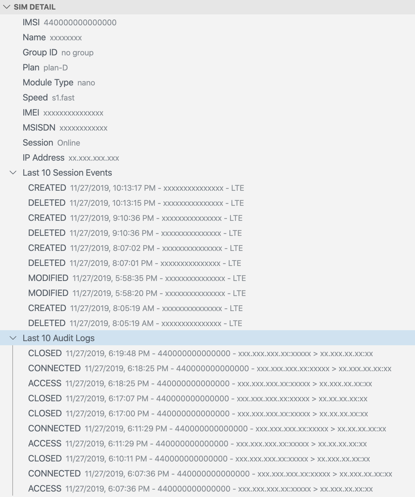

# soracom-napter-tools-vscode

This extension will assist you working with SORACOM Napter with Visual Studio Code.

Napter is an on-demand networking service for devices using Soracom Air for Cellular SIM cards, which enables you to quickly and securely access your devices remotely. Napter allows you to perform remote maintenance, troubleshooting, or other typical remote access tasks, without setting up any relay servers or installing agent software on the device.

## Requirements

- [**Visual Studio Code**](https://code.visualstudio.com/), tested on v1.81.0.
- [**Visual Studio Code Remote - SSH Extension**](https://marketplace.visualstudio.com/items?itemName=ms-vscode-remote.remote-ssh), tested on v0.102.0. See [Connect over SSH with Visual Studio Code](https://code.visualstudio.com/docs/remote/ssh-tutorial) for setup.
- **SORACOM user account**. See [SORACOM Air for セルラーの利用方法](https://soracom.jp/start/) (Japanese) or [Getting Started | Soracom IoT Connectivity](https://www.soracom.io/getting-started/) (English) for detail.
- **SORACOM API credential**. Follow [SORACOM API 利用ガイド](https://users.soracom.io/ja-jp/tools/api/) (Japanese) or [Soracom API Usage Guide](https://developers.soracom.io/en/docs/tools/api-reference/) (English) to configure your AuthKey ID and Secret. See [Supported Authentication Method](#supported-authentication-method).
- **SSH server connected with SORACOM IoT SIM** e.g. Raspberry Pi with USB dongle. Soracom provides [通信モジュール/USB ドングル](https://soracom.jp/products/module/) at the [User Console](https://console.soracom.io) or [US Online Store](https://www.soracom.io/us-store/).

## Usage

You can open **SORACOM Napter Tools** view which you can see list of your SIMs and details by one of following methods:

- Click the icon  in the Activity Bar
- Open Command Palette (<kbd>⇧⌘P</kbd>) then type <kbd>Show SORACOM Napter Tools</kbd>
- Default shortcut key (<kbd>⌃⇧N</kbd>)

### Active SORACOM SIMs View

You can see your _active_ SIMs and list, create, and delete Napter port mappings. Use icon described below or right click view items to find available actions.

|                            Icon                             | Command                                                                 | Description                                                                                                                                                               |
| :---------------------------------------------------------: | ----------------------------------------------------------------------- | ------------------------------------------------------------------------------------------------------------------------------------------------------------------------- |
|   | SORACOM Napter: Create New Port Mapping                                 | Create new port mapping.                                                                                                                                                  |
|                              -                              | SORACOM Napter: Delete Port Mapping                                     | Delete existing port mapping. Also you can delete port mapping from right click menu.                                                                                     |
|  | SORACOM Napter: Connect via Visual Studio Code 'Remote - SSH' Extension | <ul><li>Open new window with connecting the port mapping if you set `soracom.napter.ssh.autoConnection` to `true`.</li><li>Otherwise open input box for the **Remote - SSH** extension while copying connection string (`ssh://user@host:port`) in the clipboard. You can paste it and press enter to connect.</li></ul> |
|  | SORACOM Napter: Refresh SIMs List                                       | Refresh **Active SORACOM SIMs** view in the SORACOM Napter Tools view.                                                                                                      |
|    | SORACOM Napter: Toggle Coverage                                         | Toggle coverage between Japan and Global.                                                                                                                                 |
|   | -                                                                       | Copy item value to the clipboard if applicable.                                                                                                                           |

### SIM Detail View

When you select a SIM at Active SORACOM SIMs view, detail of the SIM will be displayed.

|                            Icon                             | Command                            | Description                                                   |
| :---------------------------------------------------------: | ---------------------------------- | ------------------------------------------------------------- |
|  | SORACOM Napter: Refresh SIM Status | Refresh **SIM Detail** view in the SORACOM Napter Tools view. |
|   | -                                  | Copy item value to the clipboard if applicable.               |

### Status Bar

Your user name and SORACOM operator ID will be displayed in the status bar once API authentication succeeded. Click the status bar item to open [SORACOM User Console](https://console.soracom.io).

| Icon | Command                    | Description                                                              |
| :--: | -------------------------- | ------------------------------------------------------------------------ |
|  -   | SORACOM: Open User Console | Open [SORACOM User Console](https://console.soracom.io) in your browser. |

## Extension Settings

This extension contributes the following settings.

| Key                                 | Description                                                                                                                                                                                                                            |
| ----------------------------------- | -------------------------------------------------------------------------------------------------------------------------------------------------------------------------------------------------------------------------------------- |
| `soracom.auth.useCliConfiguration`  | Use [soracom-cli](https://github.com/soracom/soracom-cli/) configuration files (`.soracom/*.json` under `$SORACOM_PROFILE_DIR` or `$HOME` directory) instead of AuthKey ID and Secret configured above. Restart required when changed. |
| `soracom.auth.profileName`          | Profile name (filename without `.json`) for your [soracom-cli](https://github.com/soracom/soracom-cli/) setup. Effective if **Soracom > Auth: Use Cli Configuration** (`soracom.auth.useCliConfiguration`) is enabled.                 |
| `soracom.auth.authkey.id`           | SORACOM API AuthKey ID                                                                                                                                                                                                                 |
| `soracom.auth.authkey.secret`       | SORACOM API AuthKey secret                                                                                                                                                                                                             |
| `soracom.endpoint`                  | Specifies coverage for SORACOM                                                                                                                                                                                                         |
| `soracom.napter.duration`           | Specifies default minutes for SORACOM Napter port mapping duration                                                                                                                                                                     |
| `soracom.napter.port`               | Specifies default remote port number for SORACOM Napter port mapping                                                                                                                                                                   |
| `soracom.napter.ssh.user`           | Specifies default remote user name for SORACOM Napter port mapping                                                                                                                                                                     |
| `soracom.napter.ssh.autoConnection` | Connect via **Remote - SSH** extension automatically after creating port mapping.                                                                                                                                                      |
| `soracom.mask`                      | Controls mask of user identifiable information such as Operator ID, IMSI, IP address, port, etc.                                                                                                                                       |

## Supported Authentication Method

Authkey method is recommended for security reason. Email and password should work (except you configured multi-factor authentication) but not tested.

| User type    | Email and password | AuthKey ID and secret |
| ------------ | ------------------ | --------------------- |
| Root account | -                  | tested                |
| SAM user     | -                  | tested                |

## Known Limitation

- You cannot specify source IP addresses ranges.
- No API sandbox support.
- No test.

## TODOs or Ideas

- implement i18n?
- display SIMs group by SIM group?
- display SIMs group by coverage?

## References

- Japanese
  - [IoT プラットフォーム 株式会社ソラコム](https://soracom.jp/)
  - [SORACOM Napter | ドキュメント | ソラコムユーザーサイト - SORACOM Users](https://users.soracom.io/ja-jp/docs/napter/)
- English
  - [Soracom | Cellular IoT Cloud Connectivity](https://www.soracom.io/)
  - [Soracom Napter Overview | SORACOM Developers](https://developers.soracom.io/en/docs/napter/)

## Contributing

Please read [CONTRIBUTING](CONTRIBUTING.md) for details.

## License

MIT. See [LICENSE](LICENSE) for details.

See license for [SORACOM Icons Set](https://dev.soracom.io/jp/docs/sis/) and [microsoft/vscode-icons](https://github.com/microsoft/vscode-icons) for icons.

---

**Enjoy remote development with SORACOM Napter!**
